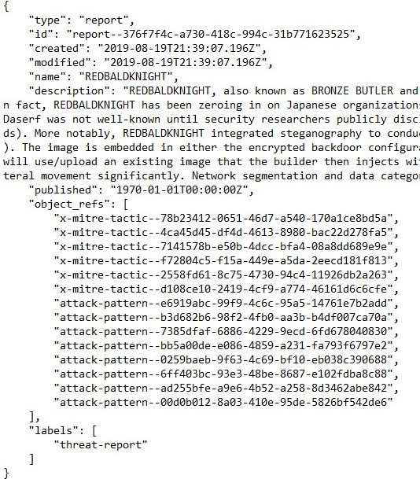
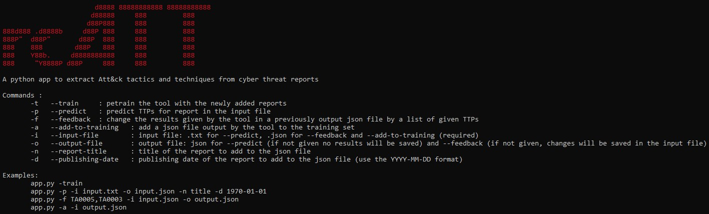
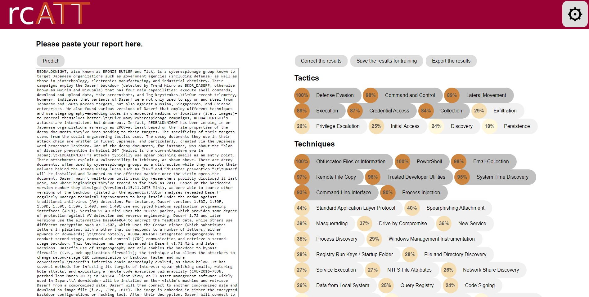
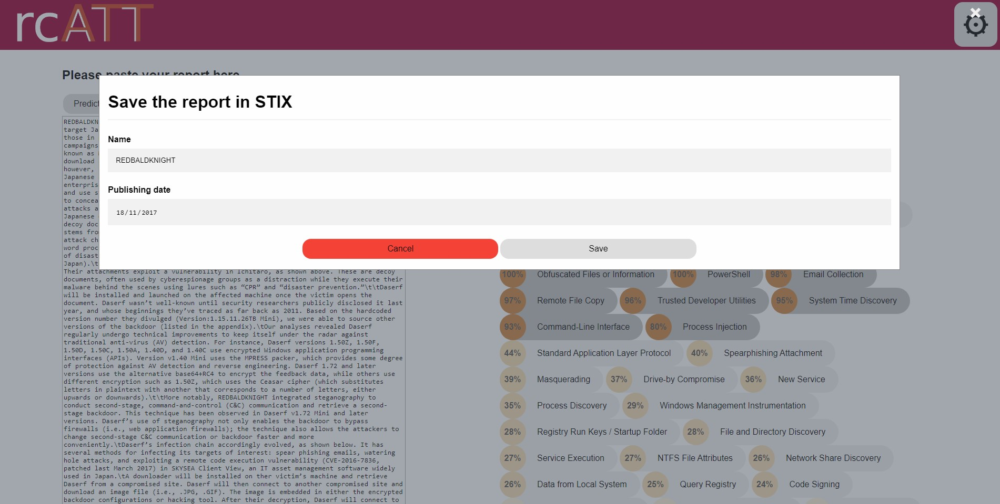

Reports Classification by Adversarial Tactics and Techniques

       <!---->

A python tool to predict Att&ck tactics and techniques from cyber threat reports.

## Usage

This tool is designed to predict tactics and techniques from the ATT&CK framework (https://attack.mitre.org/) in cyber threat reports, such as the ones that can be linked in https://otx.alienvault.com/ or https://exchange.xforce.ibmcloud.com/.

rcATT is useable either by a command-line interface or a graphical interface. Both versions have the same functionalities:
<ul>
  <li>predict tactics and techniques from a given cyber threat reports in a text format</li>
  <li>order and visualize the confidence of the classifier for each techniques and tactics, even the one predicted as non-included in the report</li>
  <li>save results in a json file in a STIX format</li>
  <li>give feedbacks to the tool by modifying the prediction to positive or negative</li>
  <li>save the feedbacks and/or the results to the training set</li>
  <li>retrain the classifier with new data</li>
</ul>

 
Example of output STIX file

## Installation
This tool requires:
<ul>
  <li><a href="https://www.python.org/">python</a> >= 3.5</li>
  <li><a href="https://joblib.readthedocs.io/en/latest/">joblib</a></li>
  <li><a href="https://pandas.pydata.org/">pandas</a></li>
  <li><a href="https://numpy.org/">numpy</a></li>
  <li><a href="https://stix2.readthedocs.io/en/latest/">stix2</a></li>
  <li><a href="https://scikit-learn.org/stable/">scikit-learn</a></li>
  <li><a href="https://www.nltk.org/">nltk</a>, and the following packages:<ul><li>punkt</li><li>stopwords</li><li>wordnet</li></ul></li>
  <li><a href="https://palletsprojects.com/p/flask/">flask</a> (only for the GUI version)</li>
  <li><a href="https://pypi.org/project/colorama/">colorama</a> (only for the command-line version)</li>
</ul>
Then simply download the tool and run that app file with python.

## How to use rcATT
### Command-line interface
#### Predict tactics and techniques from a given cyber threat reports in a text format
For the command line tool, save your report in a text file. Then use the command : python -p -i [report in a text file]

The results will be displayed sorted by likelihood of presence.

#### Give feedbacks to the tool by modifying the prediction to positive or negative
Use the command line: python app.py -f [list of tactics and techniques] -i [input a result .json file generated by rcATT] -o [output .json file]

#### Save the feedbacks and/or the results to the training set
Use the command python app.py -a -i [.json file provided by rcATT]

#### Retrain the classifier with new data
Use the command python app.py -t

#### Save results in a json file in a STIX format
In the command-line version, this step is included in the prediction or the feedback functionalities by adding an -o [output json file] to the command given. Precise a name and a date using -n [title of the report] and -d [date of publication].

### Graphical interface
#### Predict tactics and techniques from a given cyber threat reports in a text format
Enter the report in the text area and click the "predict" button.

#### Give feedbacks to the tool by modifying the prediction to positive or negative
Click the "Correct the results" button.

#### Save the feedbacks and/or the results to the training set
Click the "Save the results for training" button.
#### Retrain the classifier with new data
Click the "&#9881;" button.

#### Save results in a json file in a STIX format
Click the "Export the results" button and fill in the form (if not filled in, default values will be given) 

## More details

This tool is the result of a Mater thesis on the prediction of tactics and techniques in cyber threat reports. You can find more details on this work in the following paper: <a href="https://github.com/vlegoy/rcATT/blob/master/MScThesis_rcATT_VLegoy.pdf">"Retrieving ATT&CK tactics and techniques in cyber threat repots"</a>.
